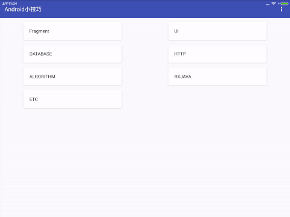

# Android Tips

&emsp;平时看到很多不错的 Android 小技巧。所以这里有个工程来记录这些小技巧的实现。

# UI 小技巧

* 着色器tint(2016.06.4)

## 2016.06.21

&emsp;1. 完成项目的RecycleView布局以及点击事件,增加Fragment切换和通信的一些简单示例.

&emsp; 2. 实现[BaseFragment和BaseActivity的封装](http://blog.csdn.net/tyk0910/article/details/51355026)

## 2016.07.05

&emsp;1. 完成一个vector的学习demo,还在完善中参考[链接](http://www.jianshu.com/p/e3614e7abc03)